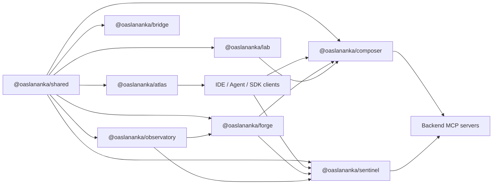
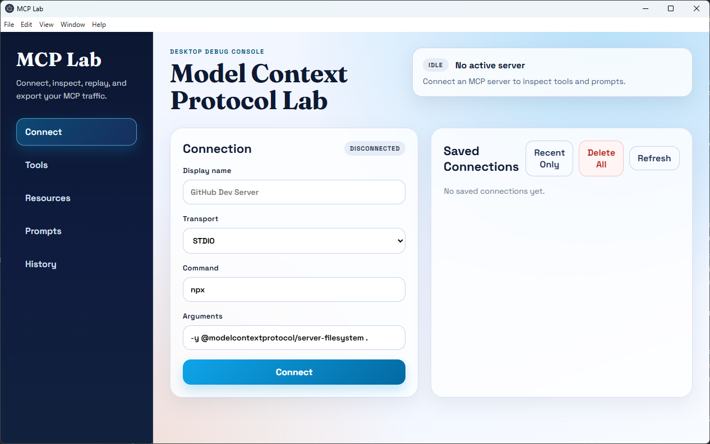

<p align="center">
  <a href="https://www.buymeacoffee.com/oaslananka">
    
  </a>
</p>

# MCP Infrastructure Suite

> The missing infrastructure layer for Model Context Protocol ecosystems.

[](./.azure/pipelines)
[](https://www.npmjs.com/search?q=%40oaslananka%20mcp)
[](./LICENSE)
[](https://modelcontextprotocol.io)
[](https://nodejs.org/)
[](https://pnpm.io/)
[](https://smithery.ai/docs)



## Why mcp-suite?

Most MCP projects stop at the server boundary. `mcp-suite` focuses on the harder production layer around it: transport compatibility, trust boundaries, orchestration, discovery, observability, and operator workflows. That makes it useful once you move past a single local demo and start running MCP in teams, CI, or internal platforms.

The suite is built for guarded GitHub-hosted release automation, with every publishable package prepared for public npm publishing under the `@oaslananka` scope. The monorepo stays strict TypeScript, Turborepo, pnpm, and release-please manifest based.

Compared with one-off MCP utilities, the packages here are designed to compose: `shared` defines the protocol/runtime baseline, `sentinel` and `composer` control traffic, `forge` orchestrates work, `atlas` catalogs capability, `bridge` generates servers, `observatory` closes the feedback loop, and `lab` gives contributors a desktop workbench.

## Packages

| Package                   | What it does                                                                    | Docs                                               |
| ------------------------- | ------------------------------------------------------------------------------- | -------------------------------------------------- |
| `@oaslananka/shared`      | Shared MCP protocol, transports, auth, retry, telemetry, and testing primitives | [Shared docs](./docs/packages/shared.md)           |
| `@oaslananka/forge`       | Pipeline engine for orchestrating MCP tools and external steps                  | [Forge docs](./docs/packages/forge.md)             |
| `@oaslananka/sentinel`    | Zero-trust security proxy with audit, approval, and PII controls                | [Sentinel docs](./docs/packages/sentinel.md)       |
| `@oaslananka/atlas`       | Registry API and catalog UI for discovering MCP servers                         | [Atlas docs](./docs/packages/atlas.md)             |
| `@oaslananka/composer`    | Aggregation proxy for multiple backend MCP servers                              | [Composer docs](./docs/packages/composer.md)       |
| `@oaslananka/bridge`      | OpenAPI and schema-first MCP server generation                                  | [Bridge docs](./docs/packages/bridge.md)           |
| `@oaslananka/observatory` | Metrics, traces, anomaly detection, alerting, and dashboard UI                  | [Observatory docs](./docs/packages/observatory.md) |
| `@oaslananka/lab`         | Electron desktop workbench for connecting to and debugging MCP servers          | [Lab docs](./docs/packages/lab.md)                 |

### MCP Lab Screenshot



## Local Playground

The reproducible demo path is a local playground with seeded Atlas and Observatory data:

```bash
pnpm install --frozen-lockfile
pnpm build
pnpm run playground:seed
pnpm run playground:atlas
```

Then start Observatory in another terminal:

```bash
pnpm run playground:observatory
```

Open Atlas at [http://localhost:4003](http://localhost:4003), Observatory at [http://localhost:4006](http://localhost:4006), and Lab with `pnpm --filter @oaslananka/lab dev`. Full steps live in the [local playground guide](./docs/guide/playground.md).

## Quick Start

```bash
pnpm install --frozen-lockfile
pnpm build

# Seed and run Atlas
pnpm --filter @oaslananka/atlas exec node dist/cli.js seed --db ./data/atlas.sqlite
pnpm --filter @oaslananka/atlas exec node dist/cli.js serve --db ./data/atlas.sqlite --port 4003

# In another terminal, run Observatory
pnpm --filter @oaslananka/observatory exec node dist/cli.js serve --db ./data/observatory.sqlite --port 4006
```

Once the services are up:

- Atlas UI: [http://localhost:4003](http://localhost:4003)
- Atlas health: [http://localhost:4003/health](http://localhost:4003/health)
- Observatory UI: [http://localhost:4006](http://localhost:4006)
- Observatory health: [http://localhost:4006/health](http://localhost:4006/health)

## Architecture

`shared` carries the protocol baseline, logger factory, transports, telemetry helpers, and test fixtures used everywhere else. MCP client-facing traffic is typically wrapped by `sentinel` for policy and audit, then aggregated through `composer`, or orchestrated from `forge`. `atlas` and `observatory` are HTTP-first operator surfaces, while `lab` is the developer-facing desktop entry point.

The suite currently defaults to MCP protocol version `2025-11-25` while keeping compatibility helpers for `2025-11-05` handshakes during the 1.0 transition.

Architecture decisions are recorded in the [ADR index](./docs/adr/index.md).

## Development

```bash
make install
pnpm run format:check
make lint
make typecheck
make test
pnpm run security
make test-coverage
make knip
pnpm run release:dry-run
```

More setup and workflow guidance lives in [docs/development.md](./docs/development.md), [docs/testing.md](./docs/testing.md), [docs/security.md](./docs/security.md), [docs/release.md](./docs/release.md), the generated API reference path in [docs/api-reference.md](./docs/api-reference.md), and the guide docs under [docs/guide](./docs/guide/introduction.md).

## Release Policy

- release-please manifest mode owns version bumps, changelogs, tags, and GitHub releases.
- GitHub Actions builds npm package tarballs, SBOM, checksums, and attestations from clean checkout state.
- Production npm publishing is separate, environment-protected, and publishes only GitHub Release package tarballs.
- Docs-only, internal-only, and CI-only changes do not publish to npm or update registry metadata.

## Contributing

Contributions are welcome. Start with [CONTRIBUTING.md](./CONTRIBUTING.md), use Conventional Commits for user-visible changes, and keep GitHub Actions parity when adding validation steps.
For issue triage, support, stale handling, labels, and maintainer response targets, see [docs/governance.md](./docs/governance.md).

## Roadmap

- `@oaslananka/gateway`: HTTP-first multi-tenant MCP gateway
- `@oaslananka/sdk`: cross-language SDK surface starting with Python
- Forge visual editor built on React Flow
- Atlas federation across multiple registry instances
- Observatory exports for Grafana and OTel collector pipelines
- Sentinel policy integration with OPA

## License

Apache 2.0 — © 2025-2026 oaslananka
