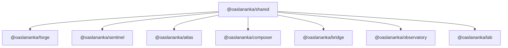
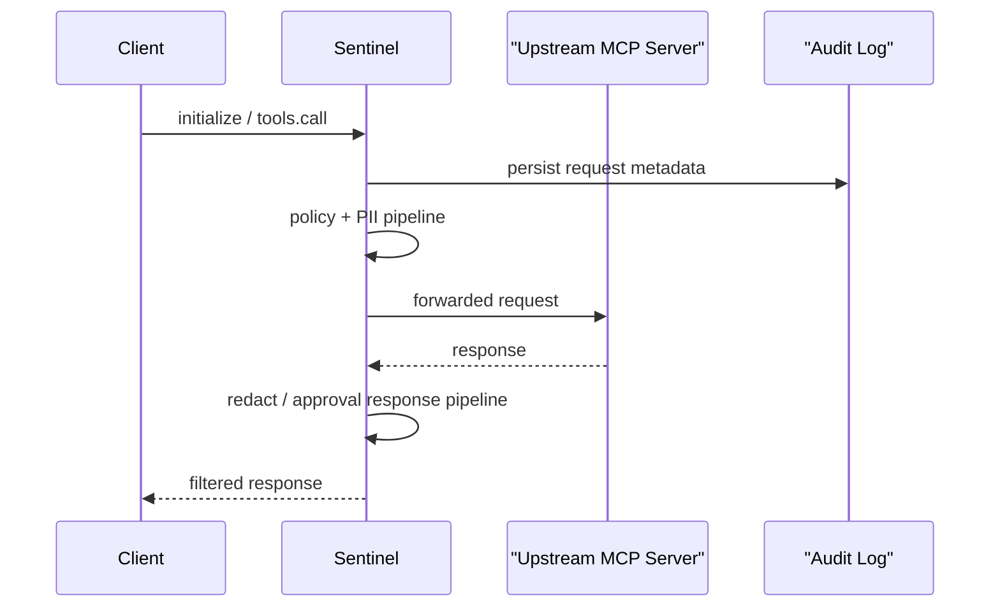

# Architecture

## Package dependency graph

## Transport layer

The suite treats transports as a first-class concern because MCP deployments often mix local stdio processes with remote services.

- `StdioTransport` is the default path for CLI-style servers such as `sentinel` and `composer`.
- `StreamableHTTPTransport` supports HTTP plus server-streamed responses and now carries protocol-version headers consistently.
- `MCPClient` and `MCPServer` negotiate between `2025-11-25` and `2025-11-05`, defaulting to the newer version unless a compatible legacy peer is detected.

## Security model

`sentinel` sits between clients and upstream MCP servers. It inspects requests, can redact PII, enforces policy and approvals, and writes an audit log before traffic reaches the upstream target.

## Data flow examples

### Composer routing

`composer` connects to several backend servers and republishes a namespaced tool inventory as a single MCP endpoint. For example, a backend tool named `search` on the `github` backend becomes `github__search` on the aggregated surface.

### Forge orchestration

`forge` executes a pipeline step-by-step, often calling back through `composer` or directly into a protected `sentinel` proxy. The result is one place to coordinate retries, branching, loops, and external HTTP steps.

### Operator surfaces

`atlas` and `observatory` are HTTP-first services. They are not used in the same request path as `composer`, but they provide the control-plane surfaces that help teams discover servers, inspect health, and monitor behavior.

## Extension points

- Add custom Forge nodes under `packages/forge/src/nodes`.
- Add Sentinel request or response policies through the proxy pipeline classes.
- Extend Atlas scoring or indexing by building on `ServerStore` and `HealthMonitor`.
- Add new anomaly detectors or alert sinks in Observatory without touching the UI contract.
